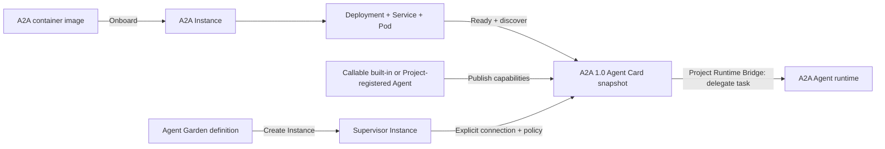

# Agent Garden technical design

## Outcome

Agent Garden is the Project-scoped catalog for discovering, onboarding, and
connecting Agents. A2A 1.0 is the only Project onboarding contract in the
current phase. LangGraph, Google ADK, LangChain, or another SDK may implement
an Agent internally, but the framework does not select a Relay adapter and is
not part of the onboarding API. It deliberately separates three concepts:

- **Agent definition** — a reusable built-in template, a Project-managed
  container, or an existing remote Agent.
- **Agent Instance** — a running workload in the shared `agents` identity
  space. Role, platform, runtime, protocols, and capabilities are independent
  dimensions. Hermes, OpenClaw, and Deep Agents are normally `SUPERVISOR`;
  a Project-managed callable service is normally `SPECIALIST` and advertises
  an A2A server protocol.
- **Agent connection** — an explicit authorization for one Coordinator
  Instance to delegate tasks to one callable built-in or Project-registered
  Agent.

“Primary Agent” and “Sub Agent” are not permanent Agent types. They are roles
inside a connection. A runtime whose manifest declares `canDelegate` is shown
as the **Coordinator** for that relationship; the target is shown as a
**Connected Agent**.



## Capability model

Eligibility is represented by independent capability flags instead of a
single “main/sub” enum.

| Capability | Meaning | OpenClaw / Hermes / Deep Agents | Claude Code | Callable A2A |
| --- | --- | --- | --- | --- |
| `interactive` | A user can work with it directly | Yes | Yes, coming soon | No |
| `canDelegate` | It may coordinate other Agents | Yes | No | No |
| `acceptsDelegation` | Another Agent may call it | No | No | Yes |

The connection service enforces the same rules as the UI:

- only READY Instances whose runtime capability declares `canDelegate` can be
  Coordinators;
- only READY catalog Agents with `acceptsDelegation` can be connected;
- built-in Supervisor definitions and Claude Code cannot be selected as
  Connected Agents;
- a registration cannot be removed while a connection still references it.

## Catalog and registration

The catalog has two layers:

- application-owned platform definitions generated from the shared runtime
  manifest: Hermes Deep Researcher, OpenClaw Generalist, Deep Agents Code, and
  Claude Code. The first three are available Supervisors; Claude Code is
  **Coming soon**;
- a versioned, database-backed example catalog seeded into each Project's
  `agent_catalog` table at startup and checked again on Garden reads.

The database catalog contains twelve ADK-inspired interaction blueprints:
Customer Service, Global KYC Agent, Nurse Handover, Deep Search, Cyber
Guardian, Academic Research, Small Business Loans, Software Bug Assistant,
Travel Concierge, Time Series Forecasting, LLM Auditor, and Personalized
Shopping. It also contains GitHub Daily Triage, Pull Request Risk Scanner, and
Release Notes Composer as A2A demos, plus Support Escalation Router as a
LangGraph implementation that exposes the same A2A 1.0 contract.

The examples support two separate interactions:

- **Try demo** sends a real A2A 1.0 JSON-RPC `SendMessage` request to a lightweight
  in-process endpoint and renders its execution trace and response;
- **Connect to…** authorizes a capable Supervisor to delegate one or more
  advertised skills.

The outputs are deterministic sample data and have no external side effects.
The cards are explicitly labeled **Blueprint** or **Demo** so the interaction
prototype is not mistaken for a deployed ADK, GitHub, ticketing, medical, or
LangGraph runtime.

Discovery uses one catalog surface for platform definitions, blueprints,
demos, and Project registrations. Built-in and Project-registered entries
remain distinguishable through card metadata instead of a separate navigation
layer or source filter.

Search and grouped capability labels are the only catalog refinement
controls. Capability labels are direct, reversible buttons; selecting any
label shows Agents matching at least one selected capability. The groups
mirror the reference experience while using TaskLattice Relay's existing cards,
typography, spacing, and interaction patterns.

The onboarding wizard reuses the same sidebar creation flow as Instance
creation. Completed steps remain clickable, future steps stay disabled, and
only the current step receives primary emphasis.

Catalog cards deep-link to a Marketplace-style detail route at
`/:projectId/agent-garden/:agentId`. The page keeps selection and activation
in one decision path:

- product brief, representative use cases, workflow, inputs, and outputs;
- advertised skills, example tasks, and participation capabilities;
- publisher, version, framework, language, protocol, support, and license;
- requirements and an explicit prototype/runtime boundary;
- **Try preview**, **Connect Agent**, or **Create Instance** according to the
  Agent's actual capabilities and status.

The richer brief is stored as versioned catalog metadata rather than embedded
only in the UI, so every Project sees the same marketplace description and
future seed versions can update it idempotently.

Project onboarding has three source tabs:

- **Container Image** is the primary implemented path. Control creates a
  Deployment and internal ClusterIP Service in the Project Runtime Namespace,
  waits for readiness, reads the Pod's resolved image ID, reapplies the
  Deployment with the immutable digest, and validates an A2A 1.0 Agent Card.
  The same operation persists the initial `A2A` Instance. It becomes
  `READY` only after the Pod is ready and the card has passed validation; a
  failed deployment remains visible as a failed Instance with lifecycle logs.
  The card must advertise a supported JSON-RPC or HTTP+JSON interface. The
  image's ENTRYPOINT/CMD is used unless command or arguments are explicitly
  supplied. Private registries reference an existing Secret by name.
- **Existing Agent** accepts only the canonical URL of a published A2A 1.0
  Agent Card. Relay selects a supported interface from that card and does not
  ask for a framework, adapter, usage mode, or separate runtime endpoint.
- **Git Repository** documents the intended input contract but is not yet
  submit-enabled. Its future builder must produce a provenance-attested OCI
  image and then enter the same immutable Container Image and A2A validation
  path.

Onboarding is a three-step flow: choose the source, configure identity and
access, then review and validate. Every Project-onboarded Agent is `CALLABLE`
and accepts delegated tasks; interactive workbenches remain a separate
Instance concern. Managed Container Image Agents remain internal to the
cluster. They run without a Kubernetes service-account token, drop Linux
capabilities, disallow privilege escalation, and use the Project namespace's
admission policy. Control verifies exact Project and Agent ownership
annotations before changing or deleting a pre-existing resource.
If deployment or discovery fails, the Project catalog record remains
`UNAVAILABLE` with the latest error so an administrator can retry the same
idempotent path or remove both runtime resources and the catalog entry.

Every managed Instance receives a stable Kubernetes resource prefix derived
from the Instance UUID:

```text
tali-a2a-<first 16 hex characters of sha256(instance UUID)>
```

The Deployment and Service use that exact name; Kubernetes appends its own
ReplicaSet suffixes to the Pod name. Selectors use the opaque
`tali.io/instance-key` hash. Workload metadata also includes hashed Project and
Agent keys, `tali.io/runtime-kind=managed-a2a`, and standard
`app.kubernetes.io/*` labels. Full Agent, Instance, Project, source-image, owner,
and category values live in annotations so long user-provided values never make
selectors invalid. A bounded `tali.io/agent-name` label keeps the Agent human
recognizable without becoming an identity key. Each Pod template also carries
a `tali.io/revision-key` hash; readiness is accepted only from the current
image, startup configuration, and metadata revision, preventing a rolling
update's previous Pod from being recorded as the active Instance.

## Discovery and endpoint security

Discovery always reads an A2A 1.0 Agent Card. A health-only endpoint is not an
onboardable Agent. The card must contain its required identity, version,
capability, default media-mode, interface, and skills fields. Relay stores the
selected interface plus a normalized A2A capability snapshot. The current
runtime supports `JSONRPC` and `HTTP+JSON` bindings; another binding must be
implemented explicitly before Relay accepts it.

Discovery applies these controls:

- HTTP(S) only, with URL credentials rejected;
- credentials are resolved by Secret reference and never stored in catalog
  payloads;
- public production endpoints require HTTPS;
- private or loopback endpoints require the explicit internal-network flag;
- redirects are not followed;
- requests time out after seven seconds;
- Agent Card payloads are limited to one megabyte;
- only interfaces declaring protocol version `1.0` are selected;
- discovered skills are copied into the Project snapshot and can be narrowed
  per connection.

## Persistence

`agent_catalog` stores Project registrations, discovery snapshots, and the
versioned example catalog. Application startup seeds all existing Projects;
the first Garden read also performs the same check so newly created Projects
are covered. Both paths upsert only missing or version-changed seed records,
making the operation idempotent while allowing future catalog revisions. The
non-callable Supervisor platform definitions remain application-owned.
`agent_connections` stores Coordinator-to-Agent authorization, approval
behavior, and an optional skill allowlist.
`agents` stores both Supervisor and onboarded A2A runtime Instances. The `kind`
discriminator selects the persistence/runtime adapter; it is not the user-facing
role or protocol type. The unified detail view derives `SUPERVISOR`,
`SPECIALIST`, or `HYBRID` role plus an independent A2A protocol profile.
`catalog_agent_id` links an A2A runtime to its reusable definition. Its payload
contains lifecycle state, namespace, Deployment, Service, Pod, pinned image,
discovered endpoint/card, skills, creator, and logs.

All three tables are Project-scoped. Database foreign keys cascade when a Project
or Coordinator Instance is deleted and restrict deletion of a connected
catalog Agent.

## API surface

| Method | Path suffix | Purpose |
| --- | --- | --- |
| `GET` | `/agent-garden` | Read built-in definitions, Project registrations, managed A2A Instances, and connections |
| `POST` | `/agent-garden/onboard` | Deploy an A2A container image or connect through an existing A2A 1.0 Agent Card |
| `POST` | `/agent-garden/agents/:id/discover` | Refresh its discovery snapshot |
| `DELETE` | `/agent-garden/agents/:id` | Remove a Project registration |
| `POST` | `/agent-garden/connections` | Authorize a Coordinator connection |
| `DELETE` | `/agent-garden/connections/:id` | Revoke a connection |

All deployed workloads use the same detail route and normalized response:

| Method | Path suffix | Purpose |
| --- | --- | --- |
| `GET` | `/instances/:id` | Read normalized identity, role, platform, runtime, protocols, capabilities, observability, and connections |
| `GET` | `/instances/:id/logs` | Read redacted stored lifecycle diagnostics under `CAP_AGENT_INSTANCE_LOG_VIEW` |
| `POST` | `/instances/:id/log-sessions` | Mint a short-lived, single-use capability for a read-only live Pod log WebSocket |

The detail UI is capability-driven and keeps the same six tabs for every
runtime: Overview, Configuration, Capabilities, Activity, Logs, and Terminal.
Unsupported tabs remain visible with a reason. A managed A2A service exposes
live stdout/stderr but not executable terminal input; Supervisor runtimes keep
their existing interactive TUI terminal. OpenClaw compatibility therefore
requires only a runtime/protocol adapter that populates the normalized view,
not another detail page.

Live logs use a separate security and transport path from interactive terminal
sessions. Control verifies the Pod's Project, Agent, Instance, runtime-kind,
and `agent` container metadata, then follows Kubernetes `pods/log` with a
bounded tail. Output is streamed into the terminal renderer in read-only mode
and conservative credential patterns are redacted before browser delivery.
The short-lived log token is minted only after
`CAP_AGENT_INSTANCE_LOG_VIEW`; terminal execution continues to require
`CAP_AGENT_INSTANCE_TERMINAL_EXEC`.

All Project-scoped Agent Garden routes pass through Capability admission. The
snapshot read requires both `CAP_AGENT_REGISTRATION_VIEW` and
`CAP_AGENT_CONNECTION_VIEW`. Registration, discovery, deletion, connection
grant, and connection revoke require their corresponding `CAP_AGENT_*`
capabilities and a relation proved from the registered Agent or Coordinator
Instance. In the current builtin presets these Agent Garden mutation
capabilities belong to Agent Developer and are limited to
`OWNER`/`MAINTAINER`; `OWNER` is implemented and `MAINTAINER` is not yet
persisted. Project Administrators receive the create-and-bind capabilities
needed to bootstrap an Instance, but do not implicitly receive existing-Agent
lifecycle or Agent Garden mutation permissions.
Project has no Environment dimension. The evaluator supports an explicit
`APPROVAL_REQUIRED` result, but the Project route adapter does not yet attach
approval requirements and the approval workflow is not implemented. See
[`capability-authorization.md`](capability-authorization.md) for the complete
current boundary.

The interaction samples also expose two intentionally small, side-effect-free
endpoints:

| Method | Path | Purpose |
| --- | --- | --- |
| `GET` | `/api/v1/demo-agents/:id/agent-card` | Read the demo Agent Card |
| `POST` | `/api/v1/demo-agents/:id` | Send one A2A 1.0 JSON-RPC `SendMessage` preview |

## Runtime boundary

The Project Agent Runtime Bridge now implements the first runtime gateway
slice. See [`project-agent-runtime-bridge.md`](project-agent-runtime-bridge.md).
It authenticates a Project/Namespace-scoped Bridge identity, loads only the
calling Coordinator's active connections, filters advertised skills, enforces
approval mode, resolves credentials in Control, and proxies A2A 1.0 messages.

Hermes owns plan and scheduling state in its Kanban database. Normalized
cross-runtime delegation/event persistence remains a later neutral Bridge API
extension instead of being coupled to the first Hermes adapter.
