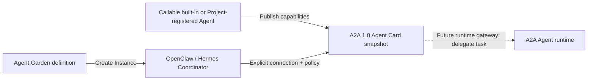

# Agent Garden technical design

## Outcome

Agent Garden is the Project-scoped catalog for discovering, onboarding, and
connecting Agents. A2A 1.0 is the only Project onboarding contract in the
current phase. LangGraph, Google ADK, LangChain, or another SDK may implement
an Agent internally, but the framework does not select a Relay adapter and is
not part of the onboarding API. It deliberately separates three concepts:

- **Agent definition** — a reusable built-in template, a Project-managed
  container, or an existing remote Agent.
- **Agent Instance** — a running OpenClaw or Hermes runtime created from a
  built-in definition.
- **Agent connection** — an explicit authorization for one Coordinator
  Instance to delegate tasks to one callable built-in or Project-registered
  Agent.

“Primary Agent” and “Sub Agent” are not permanent Agent types. They are roles
inside a connection. OpenClaw or Hermes is shown as the **Coordinator** for
that relationship; the remote Agent is shown as a **Connected Agent**.

## Capability model

Eligibility is represented by independent capability flags instead of a
single “main/sub” enum.

| Capability | Meaning | OpenClaw / Hermes | Claude Code | Callable A2A |
| --- | --- | --- | --- | --- |
| `interactive` | A user can work with it directly | Yes | Yes, coming soon | No |
| `canDelegate` | It may coordinate other Agents | Yes | No | No |
| `acceptsDelegation` | Another Agent may call it | No | No | Yes |

The connection service enforces the same rules as the UI:

- only READY OpenClaw and Hermes Instances can be Coordinators;
- only READY catalog Agents with `acceptsDelegation` can be connected;
- built-in OpenClaw, Hermes, and Claude Code definitions cannot be selected as
  Connected Agents;
- a registration cannot be removed while a connection still references it.

## Catalog and registration

The catalog has two layers:

- application-owned platform definitions: OpenClaw Generalist, Hermes Deep
  Researcher, and Claude Code marked **Built-in** and **Coming soon**;
- a versioned, database-backed example catalog seeded into each Project's
  `agent_catalog` table at startup and checked again on Garden reads.

The database catalog contains twelve ADK-inspired interaction blueprints:
Customer Service, Global KYC Agent, Nurse Handover, Deep Search, Cyber
Guardian, Academic Research, Small Business Loans, Software Bug Assistant,
Travel Concierge, Time Series Forecasting, LLM Auditor, and Personalized
Shopping. It also contains GitHub Daily Triage, Pull Request Risk Scanner, and
Release Notes Composer as A2A demos, plus Support Escalation Router as a
LangGraph implementation that exposes the same A2A 1.0 contract.

The examples support two separate interactions:

- **Try demo** sends a real A2A 1.0 JSON-RPC `SendMessage` request to a lightweight
  in-process endpoint and renders its execution trace and response;
- **Connect to…** authorizes an OpenClaw or Hermes Coordinator to delegate one
  or more advertised skills.

The outputs are deterministic sample data and have no external side effects.
The cards are explicitly labeled **Blueprint** or **Demo** so the interaction
prototype is not mistaken for a deployed ADK, GitHub, ticketing, medical, or
LangGraph runtime.

Discovery uses one catalog surface for platform definitions, blueprints,
demos, and Project registrations. Built-in and Project-registered entries
remain distinguishable through card metadata instead of a separate navigation
layer or source filter.

Search and grouped capability labels are the only catalog refinement
controls. Capability labels are direct, reversible buttons; selecting any
label shows Agents matching at least one selected capability. The groups
mirror the reference experience while using TaskLattice Relay's existing cards,
typography, spacing, and interaction patterns.

The onboarding wizard reuses the same sidebar creation flow as Instance
creation. Completed steps remain clickable, future steps stay disabled, and
only the current step receives primary emphasis.

Catalog cards deep-link to a Marketplace-style detail route at
`/:projectId/agent-garden/:agentId`. The page keeps selection and activation
in one decision path:

- product brief, representative use cases, workflow, inputs, and outputs;
- advertised skills, example tasks, and participation capabilities;
- publisher, version, framework, language, protocol, support, and license;
- requirements and an explicit prototype/runtime boundary;
- **Try preview**, **Connect Agent**, or **Create Instance** according to the
  Agent's actual capabilities and status.

The richer brief is stored as versioned catalog metadata rather than embedded
only in the UI, so every Project sees the same marketplace description and
future seed versions can update it idempotently.

Project onboarding has three source tabs:

- **Container Image** is the primary implemented path. Control creates a
  Deployment and internal ClusterIP Service in the Project Runtime Namespace,
  waits for readiness, reads the Pod's resolved image ID, reapplies the
  Deployment with the immutable digest, and validates an A2A 1.0 Agent Card.
  The card must advertise a supported JSON-RPC or HTTP+JSON interface. The
  image's ENTRYPOINT/CMD is used unless command or arguments are explicitly
  supplied. Private registries reference an existing Secret by name.
- **Existing Agent** accepts only the canonical URL of a published A2A 1.0
  Agent Card. Relay selects a supported interface from that card and does not
  ask for a framework, adapter, usage mode, or separate runtime endpoint.
- **Git Repository** documents the intended input contract but is not yet
  submit-enabled. Its future builder must produce a provenance-attested OCI
  image and then enter the same immutable Container Image and A2A validation
  path.

Onboarding is a three-step flow: choose the source, configure identity and
access, then review and validate. Every Project-onboarded Agent is `CALLABLE`
and accepts delegated tasks; interactive workbenches remain a separate
Instance concern. Managed Container Image Agents remain internal to the
cluster. They run without a Kubernetes service-account token, drop Linux
capabilities, disallow privilege escalation, and use the Project namespace's
admission policy. Control verifies exact Project and Agent ownership
annotations before changing or deleting a pre-existing resource.
If deployment or discovery fails, the Project catalog record remains
`UNAVAILABLE` with the latest error so an administrator can retry the same
idempotent path or remove both runtime resources and the catalog entry.

## Discovery and endpoint security

Discovery always reads an A2A 1.0 Agent Card. A health-only endpoint is not an
onboardable Agent. The card must contain its required identity, version,
capability, default media-mode, interface, and skills fields. Relay stores the
selected interface plus a normalized A2A capability snapshot. The current
runtime supports `JSONRPC` and `HTTP+JSON` bindings; another binding must be
implemented explicitly before Relay accepts it.

Discovery applies these controls:

- HTTP(S) only, with URL credentials rejected;
- credentials are resolved by Secret reference and never stored in catalog
  payloads;
- public production endpoints require HTTPS;
- private or loopback endpoints require the explicit internal-network flag;
- redirects are not followed;
- requests time out after seven seconds;
- Agent Card payloads are limited to one megabyte;
- only interfaces declaring protocol version `1.0` are selected;
- discovered skills are copied into the Project snapshot and can be narrowed
  per connection.

## Persistence

`agent_catalog` stores Project registrations, discovery snapshots, and the
versioned example catalog. Application startup seeds all existing Projects;
the first Garden read also performs the same check so newly created Projects
are covered. Both paths upsert only missing or version-changed seed records,
making the operation idempotent while allowing future catalog revisions. The
three non-callable platform definitions remain application-owned.
`agent_connections` stores Coordinator-to-Agent authorization, approval
behavior, and an optional skill allowlist.

Both tables are Project-scoped. Database foreign keys cascade when a Project
or Coordinator Instance is deleted and restrict deletion of a connected
catalog Agent.

## API surface

| Method | Path suffix | Purpose |
| --- | --- | --- |
| `GET` | `/agent-garden` | Read built-in definitions, Project registrations, and connections |
| `POST` | `/agent-garden/onboard` | Deploy an A2A container image or connect through an existing A2A 1.0 Agent Card |
| `POST` | `/agent-garden/agents/:id/discover` | Refresh its discovery snapshot |
| `DELETE` | `/agent-garden/agents/:id` | Remove a Project registration |
| `POST` | `/agent-garden/connections` | Authorize a Coordinator connection |
| `DELETE` | `/agent-garden/connections/:id` | Revoke a connection |

All Project-scoped Agent Garden routes pass through Capability admission. The
snapshot read requires both `CAP_AGENT_REGISTRATION_VIEW` and
`CAP_AGENT_CONNECTION_VIEW`. Registration, discovery, deletion, connection
grant, and connection revoke require their corresponding `CAP_AGENT_*`
capabilities and a relation proved from the registered Agent or Coordinator
Instance. In the current builtin presets these Agent Garden mutation
capabilities belong to Agent Developer and are limited to
`OWNER`/`MAINTAINER`; `OWNER` is implemented and `MAINTAINER` is not yet
persisted. Project Administrators receive the create-and-bind capabilities
needed to bootstrap an Instance, but do not implicitly receive existing-Agent
lifecycle or Agent Garden mutation permissions.
Project has no Environment dimension. The evaluator supports an explicit
`APPROVAL_REQUIRED` result, but the Project route adapter does not yet attach
approval requirements and the approval workflow is not implemented. See
[`capability-authorization.md`](capability-authorization.md) for the complete
current boundary.

The interaction samples also expose two intentionally small, side-effect-free
endpoints:

| Method | Path | Purpose |
| --- | --- | --- |
| `GET` | `/api/v1/demo-agents/:id/agent-card` | Read the demo Agent Card |
| `POST` | `/api/v1/demo-agents/:id` | Send one A2A 1.0 JSON-RPC `SendMessage` preview |

## Runtime boundary

The current implementation delivers the Agent Garden catalog and real
Container Image onboarding lifecycle: deployment, internal service creation,
digest pinning, Agent Card discovery, refresh, and removal. It also stores
capability-enforced desired connection state. A Coordinator connection means
“authorized for delegation”; it does not claim that a task has already run.

The runtime phase should expose one TaskLattice Relay delegation tool inside each
Coordinator. That tool will:

1. authenticate the calling Instance service account;
2. load only that Instance's active connections;
3. validate the requested discovered skill and approval mode;
4. dispatch through the selected A2A protocol binding;
5. persist task state and emit an audit event;
6. return a normalized task result to OpenClaw or Hermes.

This gateway should be implemented before labeling connections as
“runtime-synced” or allowing autonomous Agent-to-Agent execution.
